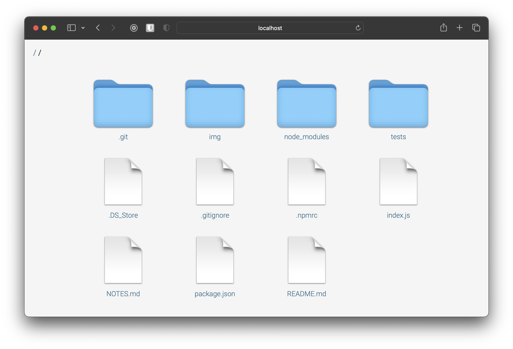

# @rockz/share
UI for serving a directory of files using compression. Double click files and folders for the zip version

<p align="center">
    
</p>

### Install
```bash
npm install -g @rockz/serve
```

### Usage
```bash
serve  # serve all subfolders from working directory
```

### Uninstall
```bash
npm remove -g @rockz/serve
```