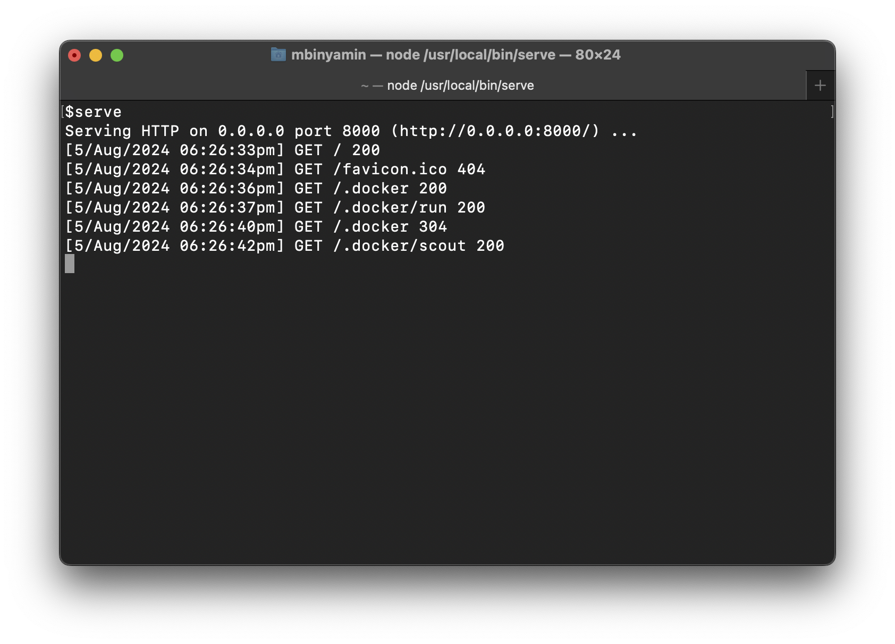

# @rockz/serve
Http file server with compression. Double click files and folders for the zip version. Feel free to leave suggestions on [github](https://github.com/Rockz-one/serve/issues/1)

<p align="center">
     
    
</p>

### Install
```bash
npm install -g @rockz/serve
```

### Usage
```bash
serve  # serve all subfolders from working directory
```

### Uninstall
```bash
npm remove -g @rockz/serve
```

### CLI 
```bash
Usage: serve [options]

Serve files with a nice ui. Single click to navigate, double click for a zip

Usage: serve [options]

Serve files with a nice ui. single click to navigate, double click for a zip

Options:
  -p, --port <int>
  -f, --forward [domain]  domain of ssh forwarding server (ex. localhost.run, rockz.one)
  -d, --domain <domain>   domain of desired url
  -k, --key <path>        private key path for forwarding agent
  -h, --help              display help for command
```

webpage tested with [https://www.webpagetest.org/](https://www.webpagetest.org/)

